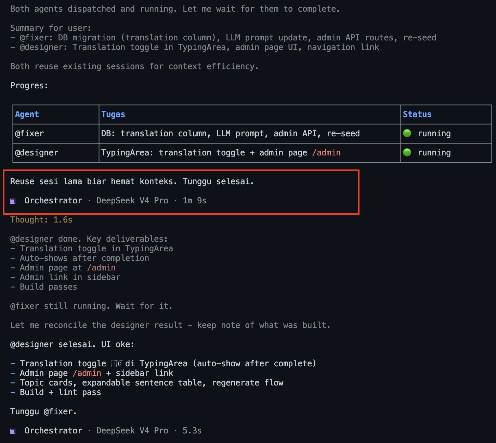
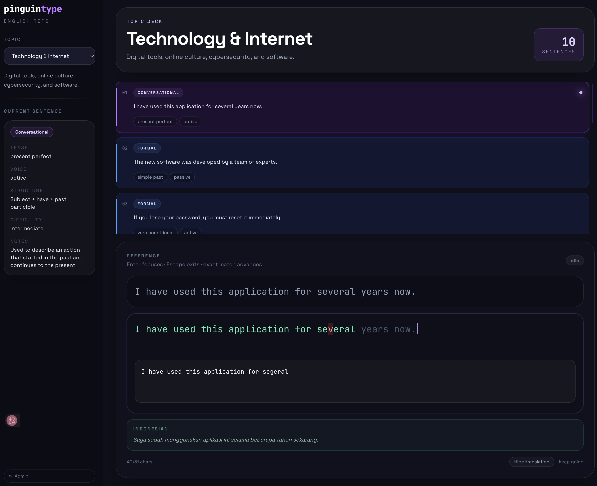
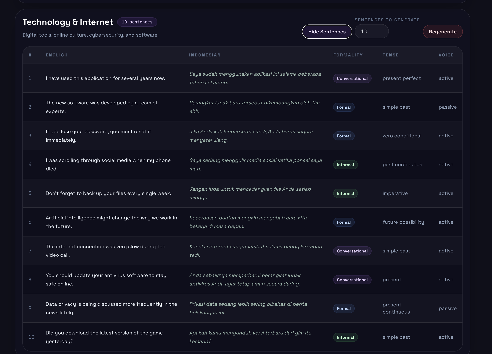
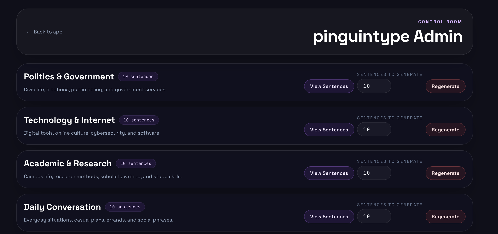

# pinguintype


```
   .--.                     ┌──────┐    ┌──────┐    ┌──────┐
  |o_o |                    │ READ │ →  │ TYPE │ →  │ LEARN│
  |:_/ |                    └──────┘    └──────┘    └──────┘
 //   \ \                        ↑                       │
(|     | )                       └───────────────────────┘
/'\_   _/`\
\___)=(___/
```

**Practice English by retyping real sentences.** Read the grammar breakdown, see the Indonesian translation, then type it out. Repetition builds intuition — not speed, not mistakes, just understanding how sentences work.

## Screenshots

| Main | Translation |
| --- | --- |
|  |  |

| Sidebar & Metadata | Admin Panel |
| --- | --- |
|  |  |

---

## What

Not a typing speed test. **pinguintype** is a grammar learning tool disguised as a typing app. Each sentence you retype teaches you something: its tense, voice, structure, and meaning in Indonesian. The repetition helps internalize patterns — active vs passive, past vs present perfect, conditionals vs modals.

Topics range from politics to daily conversation. Formality varies (formal, informal, conversational) so you learn when to use what. Every sentence is LLM-generated, so content stays fresh and diverse.

---

## Features

- 🧭 **Topic-based sentences** — Politics, Technology, Academic, Daily Conversation, Business
- 🧠 **Grammar metadata** — tense, voice, structure, difficulty, and notes per sentence
- 🎨 **Formality levels** — formal (blue), informal (green), conversational (purple) card colors
- 🇮🇩 **Indonesian translation** — toggle on/off, auto-appears on completion
- ⌨️ **Keyboard navigation** — ↑↓ select sentence, Enter focus typing, Escape exit
- ⚙️ **Admin panel** (`/admin`) — view topics, manage sentences, regenerate via LLM

---

## Tech

| Layer | Stack |
| --- | --- |
| Framework | **Next.js 16** (App Router) |
| Language | **TypeScript** |
| Styling | **TailwindCSS v4** |
| Database | **SQLite** (`better-sqlite3` + Drizzle ORM) |
| LLM | **OpenAI-compatible API** (Gemma4) |

---

## Setup

1. **Install dependencies**

   ```bash
   npm install
   ```

2. **Configure LLM API**

   ```bash
   cp .env.example .env.local
   # Edit .env.local with your provider details
   ```

3. **Migrate and seed database**

   ```bash
   npx tsx src/db/migrate.ts
   npx tsx src/db/seed.ts
   ```

4. **Start development server**

   ```bash
   npm run dev
   # → http://localhost:3000
   ```

5. **Build for production**

   ```bash
   npm run build
   npm start
   ```

---

## LLM API

Sentence generation uses an OpenAI-compatible API. Configure via environment variables:

```bash
cp .env.example .env.local
# Edit .env.local with your provider details
```

| Variable | Description |
| --- | --- |
| `LLM_BASE_URL` | API base URL (required) |
| `LLM_API_KEY` | API key (optional) |
| `LLM_MODEL` | Model name (optional) |

Works with any OpenAI-compatible provider: OpenAI, Anthropic (via proxy), Groq, local Ollama, etc. The app errors at startup if `LLM_BASE_URL` is missing.

---

## Public access (Cloudflare Tunnel)

```bash
# Start app
npm run build && npm start

# Expose via Cloudflare Tunnel
cloudflared tunnel --url http://localhost:3000
```

---

## Admin

Visit `/admin` to manage topics and regenerate sentences. No authentication required (local use).
